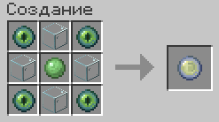

 

<h1> Craft Orbs Origins </h1>
<a style="text-decoration: none;" href="https://steamcommunity.com/id/H0dytrapl/" alt="link">Steam</a>

**Мод: Origins. Поддержка: 1.20.1+ . Тип: датапак**

О проекте
======
Датапак добавляет крафт орбов. Для серверов и прочее.

РЕЦЕПТ
======

